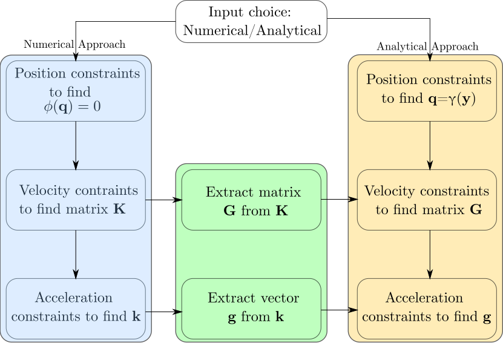
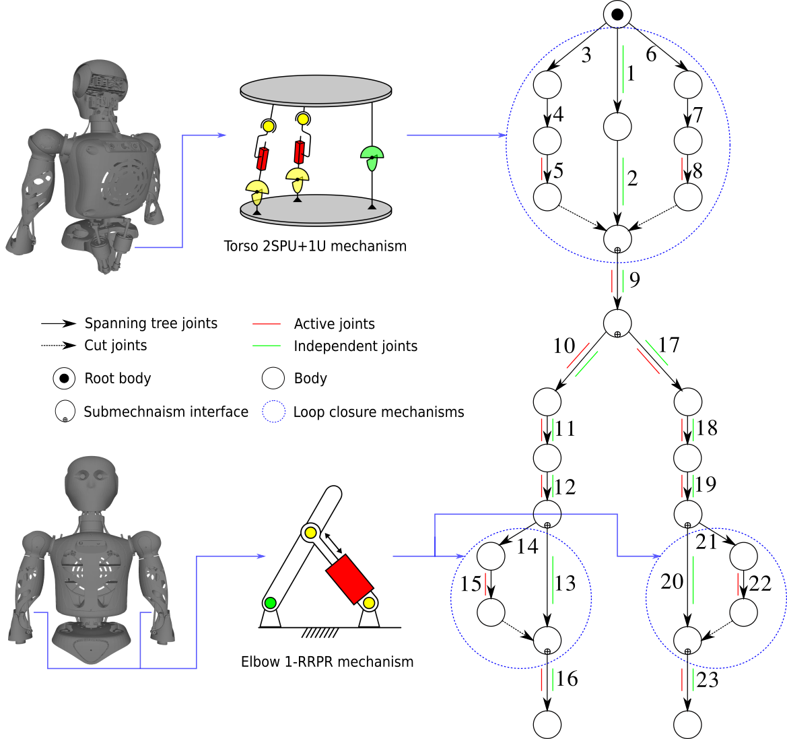
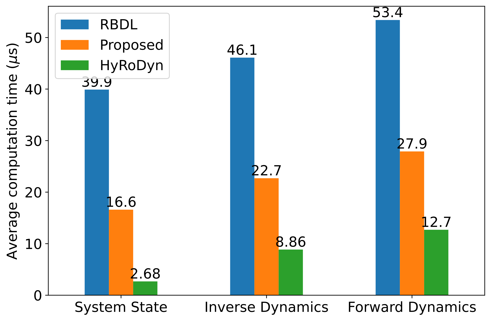
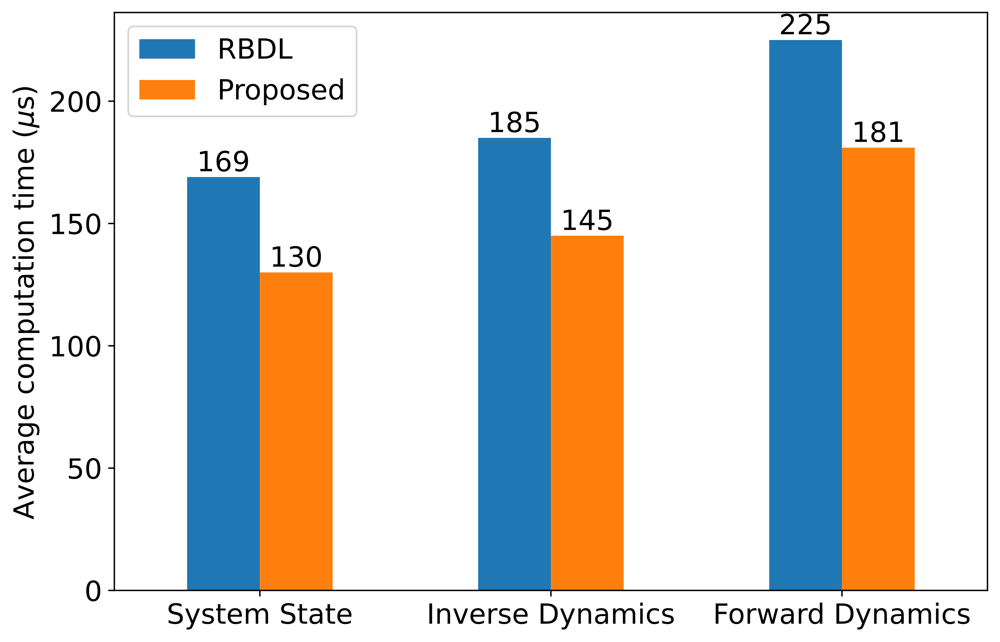

<video src="video/project_video_final.webm" controls="controls" style="max-width: 48em;"> </video>

## Introduction
The recent developments in robotics demand tackling high complexity in modeling rigid body systems. Series-parallel hybrid robots can be defined as a combination of series or tree-type chains and parallel mechanisms. While
there are many advantages of having such hybrid robots, the kinematic complexities are inherited from the serial and parallel robots. The number of holonomic constraints increases with number and complexity of closed-loop mechanism. Hence, it becomes very important to resolve the loop closures in such hybrid robots in a computationally efficient and error free manner.

## Motivation
In most of the numerical approaches, the aim is to solve the implicit constraints as they are fairly easy to setup at acceleration level. As the loop closures in the system increases, loop closure errors are inevitable and the approach suffers from computational inefficiency. On the other hand, explicit constraints are complex to setup as it requires the knowledge of analytical solutions to loop closure equations but overcomes the problem of computational inefficiency and numerical errors. 

This motivates us to combine the complementary nature of numerical and analytical loop closure methods to develop a hybrid numerical-analytical approach which exploits the modularity in the system design and the analytical solutions to loop closure constraints in commonly studied parallel mechanisms. The approach offers higher model fidelity and computational performance than a purely numerical treatment of complex series-parallel hybrid robots.

## Approach
In Fig. below, the blue column follows the derivation of implicit constraints via numerical approach and orange column follows the derivation of explicit constraints via symbolic expressions for resolving the loop closures. The green layer between them depicts the idea of deriving the explicit constraints from implicit constraints numerically. This modular approach gives freedom to a user to choose a numerical or analytical approach for a parallel submechanism module. Hence, if the constraints are requested to be resolved numerically, they are expressed in explicit form using the green layer in the figure. On the contrary, if analytical approach is requested by the user, symbolic expressions are required for that particular parallel module.

<figure>
  
  <figcaption>Fig.1 - Hybrid Approach</figcaption>
</figure>

## Example
Let us consider a reduced version of RH5 Manus robot as an example of series-parallel hybrid robot. In Fig. below, the hybrid system is represented as a serial composition of eight submechanisms, defined by the user. Among these, blue circled are closed loop submechanisms while others are serial chain subsystems. The first closed loop submechanism connected to the root of graph represents torso of the robot. It is a multi-loop mechanism of type 2SPU+1U actuated by two prismatic joints. Additionally, the elbow of robot is realized with a closed loop mechanism of type RRPR actuated with a prismatic joint. From the figure, the user can solve some closed loop mechanisms numerically and remaning analytically. Example, solving torso mechanism numerically and remaining elbow mechanisms using the availble symbolic expression.
<figure>
  
  <figcaption>Fig.2 - RH5 Manus Upper Body</figcaption>
</figure>

## Results
The computational performance is measured in CPU time. A total number of 10000 calls were made to solve the full system state (position, velocity, acceleration), inverse dynamics, and forward dynamics. The program is run on a standard laptop with Ubuntu 20.04 operating system and Intel Core i9-11950H CPU @ 2.6 GHz.

### Reduced RH5 Manus Robot Model
For the reduced version of the RH5 Manus robot with 23 spanning tree joints (as in Fig. 2.), CPU time is noted for position, velocity, acceleration, and torque analysis for randomly generated trajectories. For computational performance, three cases are studied where

* The full system is solved through numerical approach using RBDL (No. of contraints = 10).
* The full system is solved through analytical approach using HyRoDyn (No. of contraints = 6).
* The full system is solved through proposed approach where one closed loop mechanism (torso mechanism in Fig. 2) is solved numerically and other parallel mechanisms are solved analytically.

<figure>
  
  <figcaption>Fig. 3 - Comparison of CPU times between HyRoDyn, RBDL, and proposed methods for reduced RH5 Manus robot model</figcaption>
</figure>
The computational performance for the numerical approach from RBDL is $\approx 5$ times slower than the analytical approach from HyRoDyn. Also, it can be noted that proposed numerical-analytical approach performs $\approx 2$ times better than the purely numerical approach from RBDL which shows the advantage of the proposed method.

### Full Upper body of RH5 Manus Model

The computational performance is studied for the fixed-base full upper body of RH5 Manus robot model (61 spanning tree joints, 20 independent joints, and 20 actuated joints) with a parallel wrist mechanism whose symbolic expressions are not yet available in the database of HyRoDyn software. Following cases are studied:

* The full system is solved through numerical approach from RBDL including the wrist (No. of contraints = 30).
* The full system is solved through proposed approach where only wrist is solved numerically (No. of contraints = 20). 

<figure>
  
  <figcaption>Fig. 4 - Comparison of proposed and RBDL approaches for full upper body of RH5 Manus robot model</figcaption>
</figure>
The computational performance for the proposed numerical-analytical approach is $\approx 1.3$ times better when compared to RBDL.

The complete details can be found in the [paper](https://www.researchgate.net/profile/Rohit_Kumar175/publication/362126927_Modular_and_Hybrid_Numerical-Analytical_Approach_-A_Case_Study_on_Improving_Computational_Efficiency_for_Series-Parallel_Hybrid_Robots/links/62d7d205fdad924dcbf44a0b/Modular-and-Hybrid-Numerical-Analytical-Approach-A-Case-Study-on-Improving-Computational-Efficiency-for-Series-Parallel-Hybrid-Robots.pdf).